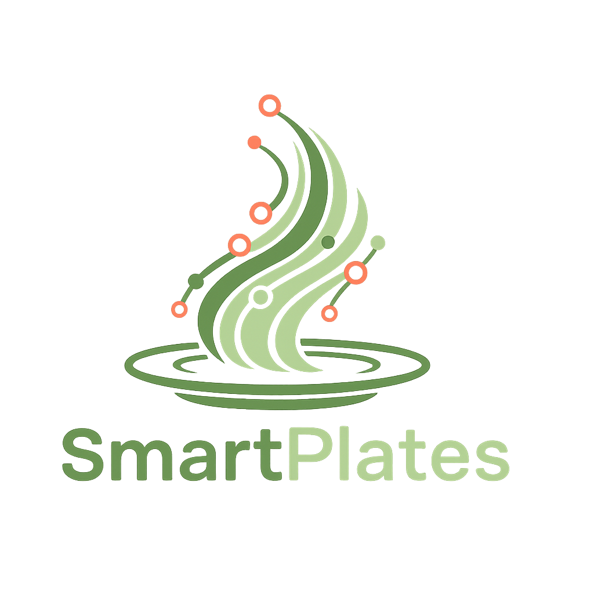

<div align="center">
  
</div>

<div align="center">

### *Effortless Meal Planning. Delicious Living.*

🚀 **Live Demo Coming Soon!**

</div>

---

## What is SmartPlates?

**SmartPlates** is a modern, AI-powered meal planning platform that transforms how people organize, plan, and prepare their meals. Whether you're a busy professional, a family looking to eat healthier, or someone who loves cooking but struggles with organization - SmartPlates makes meal planning **effortless and enjoyable**.

### The Problem We Solve

- **Meal Planning Overwhelm** → Deciding what to cook every day is exhausting
- **Food Waste** → Buying ingredients without a plan leads to waste  
- **Repetitive Meals** → Cooking the same dishes over and over gets boring
- **Grocery Shopping Chaos** → Forgetting ingredients or buying duplicates
- **Time Management** → Spending too much time thinking about food instead of enjoying it

### Our Solution

SmartPlates combines **intelligent meal planning**, **AI-powered recipe suggestions**, and **automated grocery lists** to create a seamless cooking experience that saves time, reduces waste, and brings joy back to your kitchen.

---

## ✨ Key Features

### 📅 **Smart Meal Planning**
- **Multi-View Calendar** → Weekly, daily & monthly views with drag-and-drop interface for organizing meals
- **Meal Templates** → Save and reuse successful weekly plans
- **Flexible Planning** → Plan breakfast, lunch, dinner, and snacks
- **Calendar Integration** → Export meal plans to Google Calendar

### 🤖 **AI-Powered Recipe Discovery**
- **Intelligent Recommendations** → Personalized suggestions based on your preferences
- **Fridge Analysis** → Upload photos of your fridge for ingredient-based recipes
- **Dietary Filters** → Vegetarian, vegan, gluten-free, keto, and more

### 📝 **Automated Grocery Lists**
- **Smart Aggregation** → Automatically combine ingredients from your meal plan *(in process)*
- **Quantity Optimization** → Calculate exact amounts needed
- **Store Organization** → Group items by grocery store sections *(in process)*

### 👨‍🍳 **Recipe Management**
- **Personal Recipe Collection** → Upload, save, and organize your own recipes
- **Recipe Categories** → Organize by uploaded, saved, planned, and shopping lists
- **Private Recipe Storage** → Keep your personal recipes private or share them publicly
- **Rich Media Support** → Add photos and detailed cooking instructions

### **User Experience**
- **Responsive Design** → Perfect experience on desktop, tablet, and mobile
- **Dark/Light Mode** → Choose your preferred viewing experience
- **Offline Access** → Core features work without internet connection
- **Fast Performance** → Optimized for speed with modern web technologies

---

## Interactive Features

### **For Home Cooks**
- **My Meal Plans** → Create and manage weekly meal schedules
- **Recipe Discovery** → Browse thousands of curated recipes
- **Grocery Lists** → Generate smart shopping lists automatically
- **Personal Collection** → Save favorite recipes and create custom collections
- **Cooking Mode** → Step-by-step cooking instructions with timers

### **For Food Enthusiasts**
- **Recipe Sharing** → Share your culinary creations with the community *(in development)*
- **Advanced Filters** → Find recipes by cuisine, diet, cook time, and ingredients
- **Meal Plan Templates** → Create and share meal planning templates *(in development)*

---

## 🛡️ Admin & Management Features

### **Content Management**
- **Recipe Moderation** → Quality control for community-submitted recipes
- **User Management** → Comprehensive user administration tools
- **Analytics Dashboard** → Insights into user behavior and popular recipes

### **System Administration**
- **Performance Monitoring** → Real-time system health and performance metrics
- **API Management** → Monitor external API usage and optimize costs
- **Security Controls** → User safety and content moderation tools

---

## 🚀 Technology Stack

### **Frontend Architecture**
- **Next.js (App Router)** → Modern React framework with server-side rendering and API routes
- **TypeScript** → Type-safe development for better code quality
- **Tailwind CSS** → Utility-first CSS framework for rapid, responsive UI development
- **shadcn/ui** → Beautiful, accessible component library

### **Backend & Database**
- **MongoDB** → Document-based NoSQL database for flexible data storage
- **Next.js API Routes** → Serverless API endpoints integrated with the frontend
- **Resend Auth** → Secure user authentication and authorization system

### **Media & Storage**
- **Cloudinary Storage** → Cloud-based image and video storage with optimization
- **Image Processing** → Automatic image compression and format optimization

### **AI & External Services**
- **ChatGPT OpenAI API** → Intelligent image analysis for ingredient recognition and recipe suggestions
- **Spoonacular API** → External recipe database for fetching thousands of recipes with nutritional data

### **Development & Collaboration**
- **Git & GitHub** → Version control and team collaboration
- **Render Integration** → Seamless deployment and preview environments *(in development)*

---

## Design Philosophy

SmartPlates follows a **modern, clean, and intuitive design** approach:

- **Color Scheme** → Warm greens and coral accents that evoke freshness and appetite
- **Mobile-First** → Responsive design that works beautifully on all devices  
- **Accessibility** → WCAG 2.1 AA compliant for inclusive user experience
- **Performance** → Optimized for fast loading and smooth interactions
- **Dark Mode** → Complete dark theme support for comfortable nighttime use

---

## 🏁 Getting Started

### **For Users**
1. **Sign Up** → Create your free SmartPlates account
2. **Set Preferences** → Tell us about your dietary preferences and cooking style
3. **Explore Recipes** → Browse our curated collection of recipes
4. **Plan Your Week** → Create your first meal plan using our drag-and-drop calendar
5. **Generate Grocery List** → Let SmartPlates create your shopping list automatically
6. **Start Cooking** → Follow step-by-step instructions and enjoy your meals!

### **For Developers**
```bash
# Clone the repository
git clone [repository-url]

# Install dependencies
bun install

# Set up environment variables
cp .env.example .env.local

# Start development server
bun run dev

# Visit http://localhost:3000
```

#### **Environment Variables Setup:**
The `.env.example` file contains placeholder values for:
- Database connection strings (use local MongoDB for development)
- API rate limiting configurations  
- Image processing settings
- Authentication service endpoints (use development keys)

---

## 🌟 Why Choose SmartPlates?

### **Save Time**
> Stop spending hours deciding what to cook. Let SmartPlates plan your meals in minutes.

### **Reduce Food Waste**  
> Smart grocery lists and meal planning help you buy only what you need.

### **Eat Better**
> Discover new recipes and maintain a balanced diet with our intelligent recommendations.

### **Family Friendly**
> Accommodate everyone's preferences and dietary needs in one unified platform.

### **Always Accessible**
> Access your meal plans and recipes anywhere, anytime, on any device.

---

<div align="center">

## **Ready to transform your cooking experience?**

### 🚀 **Launch Coming Soon!**

---
## 📄 License

This project is proprietary software. All rights reserved.

The codebase and application are protected by copyright law. Unauthorized copying, distribution, commercial use, or public hosting of this software is strictly prohibited.

Please see the [LICENSE.md](LICENSE.md) file for detailed terms.

*Made with ❤️ by the SmartPlates Team*

</div>